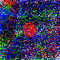
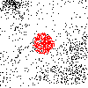
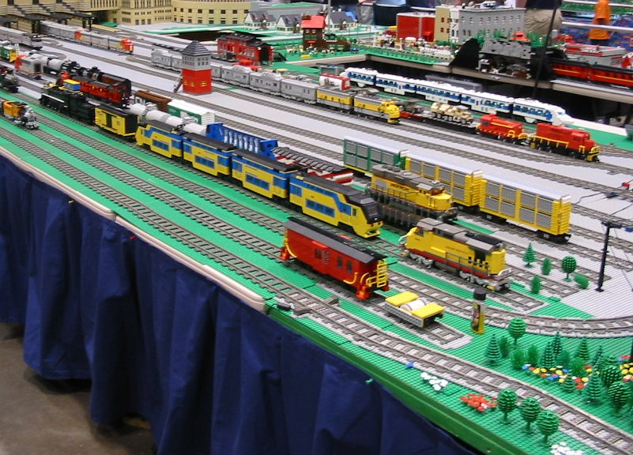
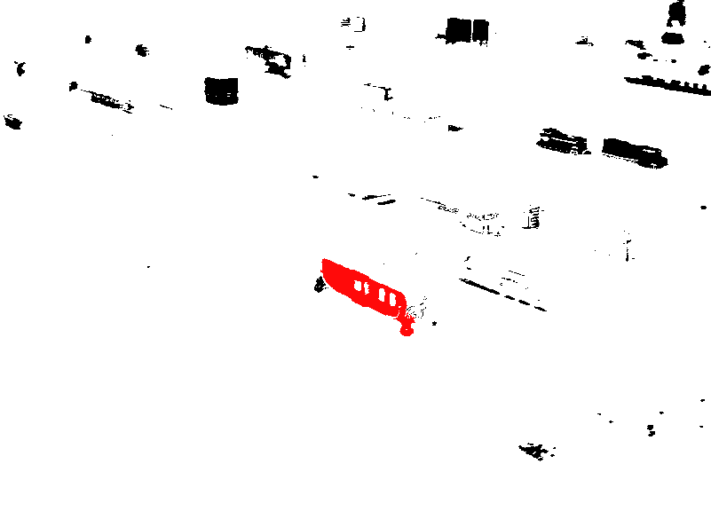
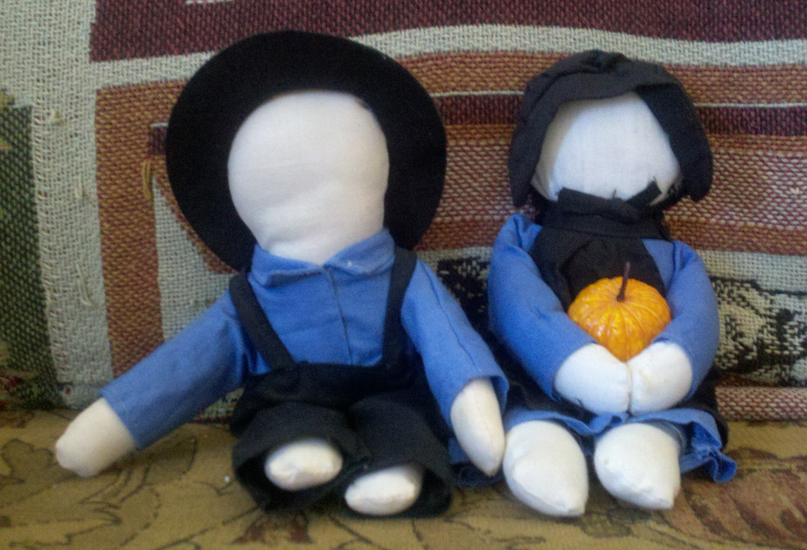
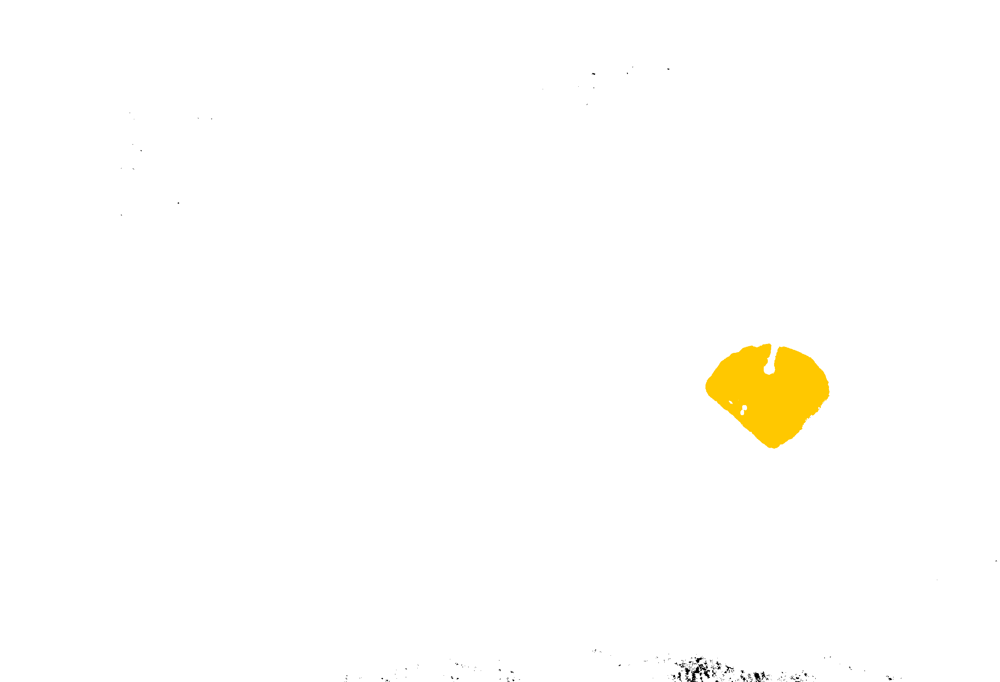
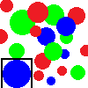
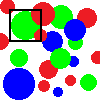

## Examples
_Basic Examples_
1. [Detect one blue circle in image 04](#example-1)
2. [Detect five blue circles in image 04](#example-2)
3. [Detect largest red area in image 05](#example-3)
4. [Detect a red train in image 07](#example-4)
5. [Detect a pumpkin in image 15](#example-5)

_Extra Credit Examples_
1. [Bound the biggest blue circle in image 04](#ec-example-1)
2. [Bound the biggest green circle in image 04](#ec-example-2)
3. [Find the ball in RoboCup (image 10)](#ec-example-3)
4. [Find a robot by its colored jersey (image 10)](#ec-example-4)
  
[back](README.md)

### Basic Examples

#### Example 1
Detect one blue circle in image 04_Circles.png

|
:---: | :---: 
input|output

```
> java BlobDetection ../input/04_Circles.png -k 1 -r 0 -g 0 -b 255 -d 5 -o ../output/04_Circles_find_1_blue.png
1/5
Blob 1: 812 pixels
- Saved result to ../output/04_Circles_find_1_blue.png
```

#### Example 2
Detect five blue circles in image 04_Circles.png

|
:---: | :---: 
input|output

```
> java BlobDetection ../input/04_Circles.png -k 5 -r 0 -g 0 -b 255 -d 5 -o ../output/04_Circles_find_5_blue.png
5/5
Blob 1: 812 pixels
Blob 2: 376 pixels
Blob 3: 304 pixels
Blob 4: 82 pixels
Blob 5: 80 pixels
- Saved result to ../output/04_Circles_find_5_blue.png
```

#### Example 3
Detect largest red area in image 05_Spray.png

|
:---: | :---: 
input|output

```
> java BlobDetection ../input/05_Spray.png -k 1 -r 255 -g 0 -b 0 -d 5 -o ../output/05_Spray_find_1_red.png
1/590
Blob 1: 291 pixels
- Saved result to ../output/05_Spray_find_1_red.png
```

#### Example 4
Detect a red train in image 07_Lego_train_layout_at_National_Train_Show_2005.jpg

|
:---: | :---: 
input|output

```
> java BlobDetection ../input/07_Lego_train_layout_at_National_Train_Show_2005.jpg -k 1 -r 255 -g 10 -b 10 -d 10 -o ../output/07_Lego_train_layout_at_National_Train_Show_2005_find_1_red.jpg
1/240
Blob 1: 2995 pixels
- Saved result to ../output/07_Lego_train_layout_at_National_Train_Show_2005_find_1_red.png
```

#### Example 5
Detect a pumpkin in image 15_Amish_Dolls_blob_find_1_pumpkin.png

|
:---: | :---: 
input|output

```
> java BlobDetection ../input/15_Amish_Dolls.jpg -k 1 -r 255 -g 200 -b 0 -d 10 -o ../output/15_Amish_Dolls_blob_find_1_pumpkin.png
1/392
Blob 1: 59638 pixels
- Saved result to ../output/15_Amish_Dolls_blob_find_1_pumpkin.png
```

### Extra Credit Examples

#### EC Example 1
Bound the biggest blue circle in image 04_Circles.png

|
:---: | :---: 
input|output

```
> java BlobDetection ../input/04_Circles.png -k 1 -r 0 -g 0 -b 255 -d 5 -o ../output/04_Circles_find_1_blue.png
1/5
Blob 1: 812 pixels
- Saved result to ../output/04_Circles_find_1_blue.png
- Saved result to ../output/04_Circles_find_1_blue_ec.png
```

#### EC Example 2
Bound the biggest green circle in image 04_Circles.png

|
:---: | :---: 
input|output

```
> java BlobDetection ../input/04_Circles.png -k 100 -r 0 -g 255 -b 0 -d 5 -o ../output/04_Circles_find_100_green.png
6/6
Blob 1: 583 pixels
Blob 2: 355 pixels
Blob 3: 341 pixels
Blob 4: 256 pixels
Blob 5: 221 pixels
Blob 6: 123 pixels
- Saved result to ../output/04_Circles_find_100_green.png
- Saved result to ../output/04_Circles_find_100_green_ec.png
```

#### EC Example 3
Find the ball in RoboCup image 10_13-06-28-robocup-eindhoven-025.jpg

|
:---: | :---: 
input|output

```
> java BlobDetection ../input/10_13-06-28-robocup-eindhoven-025.jpg -k 1 -r 255 -g 0 -b 0 -d 5 -o ../output/10_13-06-28-robocup-eindhoven-025_find_1_ball.jpg
1/184
Blob 1: 46101 pixels
- Saved result to ../output/10_13-06-28-robocup-eindhoven-025_find_1_ball.png
- Saved result to ../output/10_13-06-28-robocup-eindhoven-025_find_1_ball_ec.png
```

#### EC Example 4
Find a robot by its colored jersey in RoboCup image 10_13-06-28-robocup-eindhoven-025.jpg.

|
:---: | :---: 
input|output

```
> java BlobDetection ../input/10_13-06-28-robocup-eindhoven-025.jpg -k 1 -r 80 -g 165 -b 155 -d 1 -o ../output/10_13-06-28-robocup-eindhoven-025_find_1_robot_jersey.jpg
1/3747
Blob 1: 66572 pixels
- Saved result to ../output/10_13-06-28-robocup-eindhoven-025_find_1_robot_jersey.png
- Saved result to ../output/10_13-06-28-robocup-eindhoven-025_find_1_robot_jersey_ec.png
```