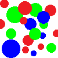

# A Simple Color Blob Detector

|||
:---: | :---: |:---: | :---: 

CS 310 Programming Assignment 4 Due: **Dec 8th** (**Saturday**) 11:59pm, 2018

## Quick Links
1. [Input/Output](#input-output)
2. [Examples Page](EXAMPLES.md)
3. [Definitions](#definitions)
4. [Task Overview and Schedule](#tasks-overview)
5. [Task Details](TASKS.md)
6. [Rules Page](RULES.md)
7. [Submission Instructions](RULES.md#submission-instructions)
8. [Grading Rubric Page](GRADING.md)

## Assignment Objectives
- Write a program to detect colored "blobs" in an image.
- Learn to use _disjoint sets_ (union-find data structure)
- Apply basic knowledge of Big-O trade offs for primitive data structures

## Assignment Overview
- Blob detection is one of the most fundamental operations in computer vision and image processing and has many many applications; [Learn more about blob detection from Wikipedia](https://en.wikipedia.org/wiki/Blob_detection)
- Color blob detection is a specific type of blob detection which can be easily performed with two passes through an image and a disjoint sets, union-find data structure.

## Input Output

### Input
- A single bitmap RGB image in jpg or png formats. 
- A positive integer _k_ >= 1, the number of blobs "of interest"
- A color to be detected (specified as red, blue, and green values)
- A "distance" from that color that is acceptable (what we think of as "red" is actually many different colors to the computer)
- A file name for the png output

### Output 
- Blob information to the console (System.out)
- A re-colored image.

## Definitions

Please familiarize yourself with these terms and their definitions before you move on.

### Pixel

- In this assignment, a pixel is a 2D coorindate of an image. 
- You can use a pixel to retrieve its color from an image. 
- A pixel _(w,h)_ can also be represented as a unique id _(h*W+w)_, where _W_ is the width of the image

### Blob

- A blob is a set of contiguous pixels. 
- A pixel can only belong to one blob. 
- Consequently, a blob is a set in the disjoint sets data structure.
- A blob is identified by one of its pixels that is the root in the disjoint sets data structure. 

### Color

- Colors can be represented in many different ways in a computer ([learn more about color models.](https://en.wikipedia.org/wiki/Color_model))
- We will be using the [RGB color model](https://en.wikipedia.org/wiki/RGB_color_model) for this assignment.
- This is an additive color model where red, green, and blue are "intensities" between 0 (none) and 255 (high) (0->255 is two digits in hex).
- In RGB, the hex value of black is #000000, red is #FF0000, green is #00FF00, blue is #0000FF, and white is #FFFFFF.

### Distance

- Two colors may be considered to be some "distance" apart (e.g. "black" and "white" are "far away" from each other.
- A smaller distance indicates stronger similarity (e.g. "red" and "dark red").
- For this assignment, the furthest distance between two colors is the distance between pure white and pure black.

## Tasks Overview

There are **4** tasks in this assignment. It is recommended that you implement these tasks in the given order:

- Task 0: Read the given code (0%)
- Task 1: Implement Disjoint Sets (the union-find data structure) (25%)
- Task 2: Implement Helper Methods (20%)
- Task 3: Implement the Detector (45%)
- Task 4: Output (10%)
- (Optional) Task 5: Output Original Image with a "Bounding Box" (5%)

See [Task Details Page](TASKS.md "").

Need a schedule?
- You've got 4.5 weeks.
- You have other classes with final exams/projects.
- Assume you want to spend the last week doing the EC and getting additional help.
- Keeping those things in mind, fill in the following:
  - Week 0 (11/08-11/11): _______________________________ (first weekend)
  - Week 1 (11/12-11/18): _______________________________
  - Week 2 (11/19-11/25): _______________________________ (don't forget the break!)
  - Week 3 (11/26-12/02): _______________________________ 
  - Week 4 (12/03-12/08): _______________________________ (remember, Saturday due date, not Sunday!)

## Examples, Rules, and Grading
See [Examples Page](EXAMPLES.md ""). Need more examples? Look in the [output folder](../output "").

As with all projects in CS310, we have some rules (see [Rules Page](RULES.md "")) and a grading rubric (see [Rubric Page](GRADING.md "")). The [ImageMagick](https://www.imagemagick.org/script/index.php) information is on the [Rubric Page](GRADING.md "").